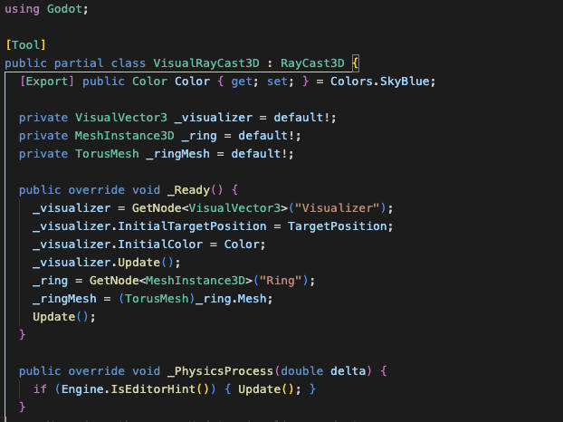

This past week, I spent some time investigating the differences between GDScript and C#. I've been creating a lot of C# libraries for Godot lately, so it was important for me to get a sense of which use cases might warrant the additional complexity of C#.

<!-- truncate -->

## 👀 Anecdotal Evidence

If you search online, you'll find a lot of anecdotal evidence suggesting that C# is significantly faster than GDScript. This makes sense, since C# is typically faster than most interpreted languages. But performance is a complex thing, and I wanted to know for myself! 🧠

## 🔍 Let's Test It

I did some testing with GDScript and C# for the 2 types of processing-heavy systems that I often use:

### 🧮 Test Case 1: Evaluating Physics Expressions at Runtime

To test out expression evaluation, I wrote small scripts that parse math expressions using code that I typically implement inside a larger system. For this test, I did the following:

1. Generate a semi-complex math expression with multiple operators, variables, and nested expressions.
2. Parse the expression recursively, evaluating it with actual values for the variables.
3. Run this evaluation 100,000 times.

Here are the results (lower is better):

| Language | Time (seconds) |
| -------- | -------------- |
| GDScript | 8.9            |
| C#       | 2.2            |

**Result**: C# was 4x faster. 🌟

### 🎲 Test Case 2: State Machines

I also do a lot of state machine programming, which involves tracking state transitions that might happen multiple times per frame. To test this, I:

1. Create simple state machine-like code to simulate transitioning between game states.
2. The state machine includes state initialization, transition evaluation, and state updates.
3. Run it for 10 million iterations.

Here are the results (again, lower is better):

| Language | Time (seconds) |
| -------- | -------------- |
| GDScript | 42.8           |
| C#       | 1.4            |

**Result**: C# was 30x faster! 🚀

## 📦 Chickensoft's C# Packages

I've been working on open-source packages for Godot using C#, and they can help you leverage this performance advantage in specific scenarios without having to write everything in C#.

Visit [Chickensoft](https://chickensoft.games) to explore all of our packages that can help you build better games with Godot and C#!

## 🤔 When Should You Use C#?

Based on these tests and my experience, here's when you might want to consider C# for your Godot project:

- Complex games with high performance requirements
- Systems involving a lot of calculations (physics, procedural generation, etc.)
- Projects where you want to reuse existing C# libraries
- Large projects where static typing provides more stability
- Games with complex state management

However, GDScript is still great for:

- Prototyping
- Simple games
- Most UI logic
- Scripting game objects that don't need high-performance calculations
- Projects where you want to avoid the overhead of managing a C# development environment

## 🔮 The Future

Godot 4 has improved GDScript's performance, but there's still a significant gap. Future versions might bring more improvements, but C# will likely maintain its performance edge for compute-intensive tasks.

The good news is that you don't have to choose just one! You can mix GDScript and C# in the same project, using each where it makes the most sense.

Join our Discord: [https://discord.gg/gSjaPgMmYW](https://discord.gg/gSjaPgMmYW)

_If you enjoyed this post, please consider starring our [GitHub repositories](https://github.com/chickensoft-games) and following us on socials!_
