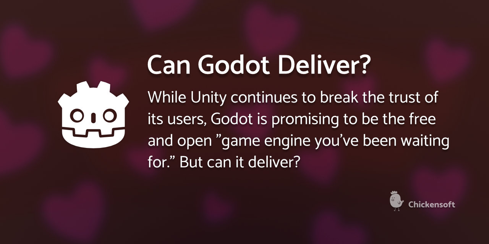

In the wake of Unity's latest debacle (introducing a runtime fee that will charge developers for each game installation), the Godot Engine is enjoying an unprecedented surge in attention. But will Godot be able to meet the expectations of thousands of developers looking for a Unity replacement?

<!-- truncate -->

## 🌟 The Godot Gold Rush

Unity, once beloved in the indie game development community, is having its reputation dismantled in record time. On September 12, 2023, Unity announced a new [Runtime Fee](https://blog.unity.com/news/plan-pricing-and-packaging-updates) that would charge developers for each time their game is installed after reaching certain thresholds. The change would apply retroactively to developers who have already published games.

The fallout was immediate. In the 48 hours after the announcement:

- Unity's stock fell over 20%
- "How to refund Unity Pro" became a trending search term
- Developers began mass-migration to Discord channels, forums, and social media groups dedicated to Unity alternatives

The largest beneficiary of this exodus? [Godot Engine](https://godotengine.org), the free and open-source game development platform.

## 🛑 Unity's Crisis of Trust

Unity's decision represents more than just a pricing change — it's a fundamental breach of trust with their developer community. Here's why:

1. **Retroactively changing the rules**: Developers who built their entire business models based on one payment structure are now being told the rules have changed after they've already published.

2. **Impossible tracking requirements**: Unity requires tracking installations, but hasn't provided a reliable way to do this, especially for games distributed through bundles, subscriptions, or physical media.

3. **Punishing success**: The fee specifically targets successful games, effectively becoming a "success tax" that wasn't part of the original agreement.

4. **Unclear definitions**: Terms like "installation" remain poorly defined, creating uncertainty for developers about their potential financial obligations.

But perhaps most damaging is the way this change was communicated: suddenly, without developer consultation, and defended with corporate double-speak even as the gaming community erupted in outrage.

## 🌱 Enter Godot: The People's Engine

Against this backdrop, Godot is positioned as the ethical alternative. It offers:

- **Truly free licensing**: MIT license with no royalties, no runtime fees, and no subscription costs
- **Open governance**: Development is overseen by a non-profit foundation
- **Transparent roadmap**: Future plans are discussed openly with the community
- **No investor pressure**: No VCs or shareholders demanding increased monetization

For developers burned by Unity's decisions, these factors make Godot extremely attractive. But can it actually deliver as a Unity replacement?

## 🔍 The State of Godot in 2023

Godot 4.0 released in March 2023, bringing significant improvements:

- **New rendering engine**: Vulkan support, significantly improved 3D capabilities
- **Better performance**: Improved CPU/GPU utilization
- **Enhanced physics**: New physics engine with better stability
- **C# improvements**: Better integration of C# scripting support

The engine has come a long way, but several challenges remain:

1. **Documentation gaps**: While improving, documentation still has holes, especially for advanced features
2. **Ecosystem maturity**: Asset marketplace and plugin ecosystem is still developing
3. **Optimization challenges**: Performance optimizations often require more manual work than in Unity
4. **Console support**: Official console export is still being developed

## 🔮 Can Godot Truly Replace Unity?

For many developers, especially indies, Godot is already capable of meeting their needs. Games like [Dome Keeper](https://store.steampowered.com/app/1637320/Dome_Keeper/), [Ex Astris](https://store.steampowered.com/app/1716360/Ex_Astris/), and [Brotato](https://store.steampowered.com/app/1942280/Brotato/) demonstrate that commercial success is possible.

However, certain types of developers may face challenges:

- **AAA studios**: May find Godot lacks some enterprise-level features
- **Mobile-focused devs**: Unity still offers more streamlined mobile optimization tools
- **Teams with extensive Unity expertise**: Face a learning curve when switching

The good news is that Godot's development pace is accelerating. The project has seen:

- Increased funding (though still a fraction of Unity's resources)
- Growing corporate interest and sponsorship
- Expanding contributor base, especially after Unity's announcement

## 🧰 My Experience with Godot

I've been using Godot for several years, primarily with C#. My perspective is that:

1. **C# support is solid but requires knowledge**: Working with C# in Godot is entirely possible (and in some ways preferable), but requires understanding how the integration works.

2. **Documentation is improving**: The official docs get better with each release, and community resources are filling the gaps.

3. **The editor is highly productive**: Once you adapt to Godot's workflow, many tasks become more streamlined than in Unity.

4. **Community support is exceptional**: The Godot community is incredibly helpful and welcoming to newcomers.

## 🚀 Will Godot Seize the Moment?

Godot has an unprecedented opportunity right now. The project is seeing:

- Record numbers of GitHub stars and forks
- All-time high download numbers
- Explosion of tutorial content and community resources
- Increased financial support through donations

But success isn't guaranteed. The project will need to:

1. **Rapidly improve onboarding**: Make the transition for Unity developers as smooth as possible
2. **Address enterprise needs**: Develop features needed by larger teams
3. **Maintain focus**: Resist feature bloat while addressing critical gaps
4. **Leverage the community**: Channel the current enthusiasm into sustainable contribution

## 🏆 The Verdict

Can Godot deliver on its promise to be the game engine we've been waiting for? I believe the answer is **yes for many developers, eventually for most others**.

The engine is already capable enough for a wide range of games. What it lacks in features, it makes up for in freedom, flexibility, and community goodwill. And unlike proprietary engines, its open nature means that progress benefits everyone equally — there's no risk of surprise runtime fees or other unwelcome changes to the core business model.

For those considering the switch, now is the perfect time to begin learning Godot. Even if it doesn't meet all your needs today, the pace of development suggests it will continue closing the gap with remarkable speed.

As for Unity, they've created an opening that Godot and other alternatives will eagerly fill. The coming months will show whether Unity understands the damage they've done to their brand and developer relationships — and whether any response they offer will be enough to regain the trust they've lost.

_If you've recently switched to Godot and are looking for resources, especially for C# development, check out [Chickensoft's open source packages](https://chickensoft.games) and our [Discord community](https://discord.gg/gSjaPgMmYW)._

Join our Discord: [https://discord.gg/gSjaPgMmYW](https://discord.gg/gSjaPgMmYW)
