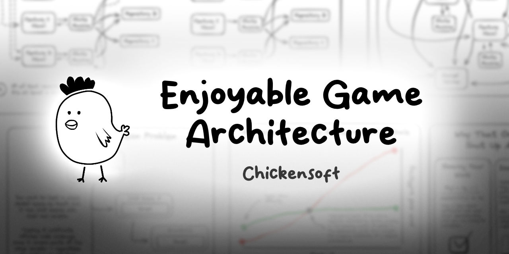

Creating great game architecture is more important than ever. With more developers making more complex games, we need architecture that's both scalable and enjoyable to work with.

<!-- truncate -->

## 👋 Introduction

I spent most of the year developing a set of open-source packages for Godot C#. These packages were designed with game architecture in mind, and they take inspiration from:

1. Functional programming
2. Event-driven programming
3. Object-oriented programming

These approaches all have pros and cons, but they work well together when properly balanced.

## 🧮 Understanding Game Architecture

Every game has three crucial aspects to consider:

1. **State**: What is true right now about the game and its elements
2. **Logic**: The rules that govern how the game behaves
3. **Presentation**: How the game is shown to the player

Good architecture separates these concerns while also providing clear ways for them to interact.

## 🕹️ Common Architecture Patterns

Several patterns are commonly used in game development:

### 1. The Traditional Scene Tree Approach

In engines like Godot, the scene tree is your native architecture. Objects in the tree are connected by:

- Parent-child relationships
- Signals/events
- Direct references

**Pros:**

- Simple to understand
- Natural mapping to visual elements
- Built-in communication methods

**Cons:**

- Can lead to tight coupling
- May create complex dependency webs
- Hard to unit test

### 2. Entity Component System (ECS)

A more data-oriented approach where:

- Entities are just IDs
- Components are pure data
- Systems act on entities with specific components

**Pros:**

- Highly performant
- Great data locality
- Clear separation of concerns

**Cons:**

- Less intuitive for many programmers
- Learning curve
- Often overkill for smaller games

### 3. Model-View-Controller (MVC) and Variants

Separates your game into:

- Models (data)
- Views (visuals)
- Controllers (logic)

**Pros:**

- Clear separation of roles
- Easier to test
- Reusable components

**Cons:**

- Can be overly rigid
- Needs adaptation for games
- May add unnecessary complexity

## 🔮 The Future of Game Architecture

The ideal game architecture blends multiple approaches:

1. **Scene tree for visual hierarchy** - Maintain the intuitive parent-child relationships for visual elements and physics

2. **Dependency injection for services** - Provide access to global services without creating tight coupling

3. **State machines for complex objects** - Model complex behavior with clear, manageable states

4. **Event-driven communication** - Decouple systems by using events rather than direct method calls

5. **Functional core with side effects at the edges** - Keep core logic pure and predictable

## 🛠️ Architecture in Practice

In the [Chickensoft Game Demo](https://github.com/chickensoft-games/GameDemo), I've implemented this hybrid architecture:

1. **Node-based Scene Tree** - Natural Godot structure with visual parent-child relationships

2. **Hierarchical State Machines** - Complex objects use [LogicBlocks](https://github.com/chickensoft-games/LogicBlocks), a hierarchical state machine implementation

3. **Dependency Injection** - Systems find services through [AutoInject](https://github.com/chickensoft-games/AutoInject), which searches up the scene tree

4. **Event Bus** - Global events allow decoupled communication between systems

Here's a video walkthrough of the architecture:

[Watch on YouTube](https://www.youtube.com/watch?v=LEethjxNnrw)

## 📋 Architecture Checklist

How can you tell if your architecture is good? Ask these questions:

- Can you change one system without breaking others?
- Is testing straightforward?
- Do new team members understand the code quickly?
- Can you add new features without rewriting existing code?
- Does the architecture help or hinder performance?
- Is the system resilient to bugs?

## 🧪 Unit Testing Game Architecture

Good architecture enables thorough testing. In our game demo, we use:

1. **Mocking frameworks** to isolate components
2. **Component testing** to verify behaviors
3. **State-based testing** to ensure state machines behave correctly

Well-tested architecture catches bugs before they reach players and makes refactoring safer.

## 📊 Scaling Your Architecture

The same principles apply regardless of team size, but larger games require:

1. **More formalized interfaces** between systems
2. **Better tooling** to manage complexity
3. **Clearer documentation** of architectural decisions
4. **Performance optimization** at architectural boundaries

## 🏆 Conclusion

Great game architecture isn't about following a single pattern perfectly—it's about creating a system that:

1. Makes development enjoyable
2. Scales with your project's complexity
3. Facilitates collaboration
4. Prevents bugs
5. Performs well

The best architecture is often invisible—it simply makes everything work without getting in your way.

[Chickensoft GameDemo on GitHub](https://github.com/chickensoft-games/GameDemo)

Join our Discord: [https://discord.gg/MjA6HUzzAE](https://discord.gg/MjA6HUzzAE)
