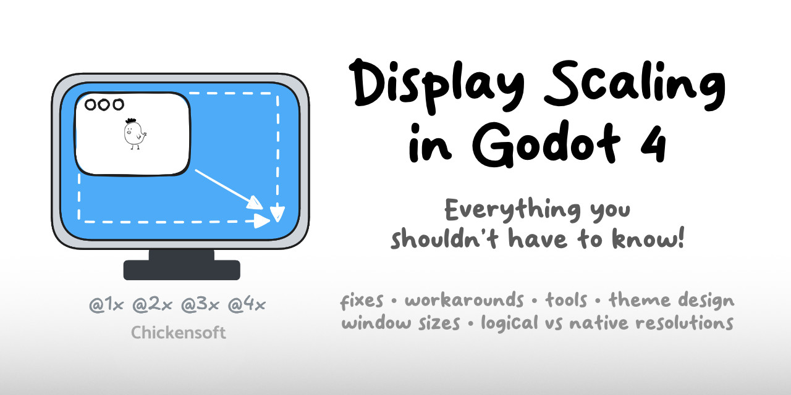
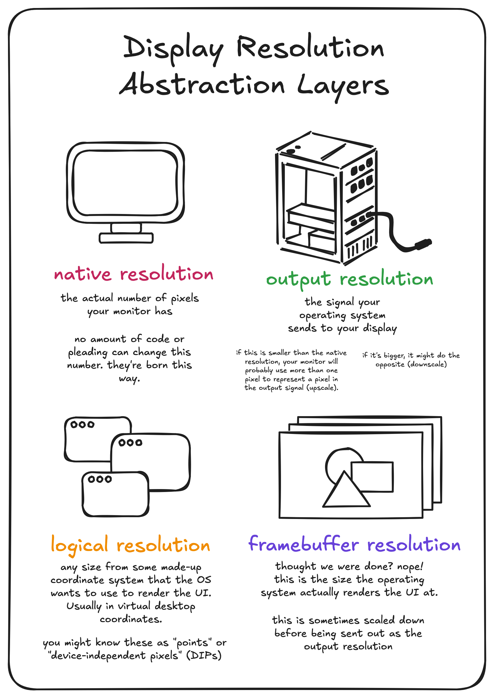

The last thing most gamedevs want to deal with is resolving the complexities of scaling a UI to look good on any screen, but a good scaling system is essential to creating a great player experience.

<!-- truncate -->

## 📏 Why Scaling Matters

In game development, display scaling can be a source of unexpected complexity that distracts from the core gameplay experience you're trying to create. But ignoring it leads to poor player experiences, especially in our multi-device world.

Players expect your game to look good whether they're using:

- A 13" laptop with a resolution of 1280x800
- A 30" 4K monitor at 3840x2160
- A mobile phone with a small but high DPI screen
- A Steam Deck or other handheld gaming device
- Their TV via Steam's Big Picture mode

The challenge is to create a single interface that adapts to all these scenarios while maintaining the intended look and feel of your game. This is particularly important for:

1. Pixel art games that need precise scaling to maintain crisp visuals
2. Text elements that need to remain legible across devices
3. Interactive elements that need to remain comfortably clickable

## 🔍 The Unity Approach

If you're coming from Unity, you might be familiar with their Canvas Scaler component, which offers three scaling modes:

- **Constant Pixel Size**: UI elements maintain the same pixel size regardless of screen resolution
- **Scale With Screen Size**: UI scales based on a reference resolution
- **Constant Physical Size**: UI elements maintain the same physical size regardless of screen size and DPI

Each approach has its own trade-offs in terms of flexibility, ease of implementation, and final visual quality.

## 🎮 A Godot Solution

I've created a scaling system for Godot that takes inspiration from Unity's approach while adding some additional flexibility. This system lives in a class called `DisplayScaler`, which you can drop into any Godot project.


The `DisplayScaler` class offers multiple scaling options:

- **Fixed**: Similar to Unity's Constant Pixel Size
- **Fit Width**: Scales the UI to fit the width of the screen
- **Fit Height**: Scales the UI to fit the height of the screen
- **Expand**: Takes the smaller of width and height scaling (ensures everything fits)
- **Shrink**: Takes the larger of width and height scaling (ensures the screen is filled)

## 💡 Implementation Details

Here's the core of the implementation:

```csharp
public partial class DisplayScaler : Node {
  [Export] public DisplayScalingMode ScalingMode { get; set; } = DisplayScalingMode.Fit;
  [Export] public Vector2I ReferenceResolution { get; set; } = new(1280, 720);
  [Export] public bool PixelPerfect { get; set; } = true;
  [Export] public float ReferenceScale { get; set; } = 1.0f;
  [Export] public float MinScale { get; set; } = 0.25f;
  [Export] public float MaxScale { get; set; } = 8.0f;

  public override void _Ready() => UpdateScale();

  public override void _Process(double delta) => UpdateScale();

  private void UpdateScale() {
    var viewport = GetViewport();
    var windowSize = viewport.GetVisibleRect().Size;

    float scale = ComputeScale(windowSize);

    if (PixelPerfect) {
      scale = Mathf.Floor(scale);
      scale = Mathf.Max(1.0f, scale);
    }

    scale = Mathf.Clamp(scale, MinScale, MaxScale);
    viewport.GetWindow().ContentScaleFactor = scale;
  }

  private float ComputeScale(Vector2 windowSize) {
    var xScale = windowSize.X / ReferenceResolution.X;
    var yScale = windowSize.Y / ReferenceResolution.Y;

    return ScalingMode switch {
      DisplayScalingMode.Fixed => ReferenceScale,
      DisplayScalingMode.FitWidth => xScale * ReferenceScale,
      DisplayScalingMode.FitHeight => yScale * ReferenceScale,
      DisplayScalingMode.Fit => Mathf.Min(xScale, yScale) * ReferenceScale,
      DisplayScalingMode.Fill => Mathf.Max(xScale, yScale) * ReferenceScale,
      _ => ReferenceScale
    };
  }
}

public enum DisplayScalingMode {
  Fixed,
  FitWidth,
  FitHeight,
  Fit,
  Fill
}
```

With this system in place, you can easily adjust how your UI scales based on the specific needs of your game.

## 🧩 Integration with UI Systems

To make the most of this scaling system, you'll want to design your UI with responsiveness in mind:



- Use **anchors** and **margins** to position UI elements relative to their container
- Group elements logically with containers that can expand or contract
- Test regularly on different resolutions to catch issues early

## 🎓 Lessons From the Field

Based on my experience implementing UI scaling across multiple projects, here are some additional tips:

1. **Separate your UI layer**: Keep your game world rendering separate from your UI rendering
2. **Consider multiple UI layers**: Sometimes you want elements that scale differently (e.g., debug info that's always the same size)
3. **Don't forget about input**: If you're scaling your display, make sure your input handling scales accordingly

## 🎯 Wrapping Up

Display scaling doesn't have to be a headache. With a systematic approach like the one outlined here, you can create a UI that looks great on screens of all sizes without getting bogged down in complex edge cases.

Remember, the goal is to spend less time fighting with your UI and more time creating an awesome game experience!

[Check out the DisplayScaler on GitHub](https://github.com/chickensoft-games/DisplayScaler)

Join our Discord: [https://discord.gg/MjA6HUzzAE](https://discord.gg/MjA6HUzzAE)
