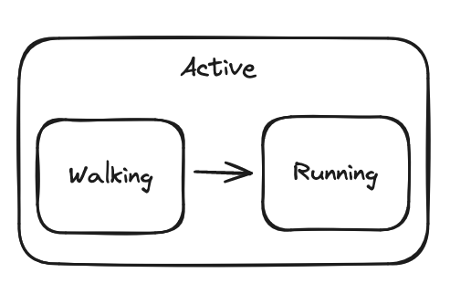
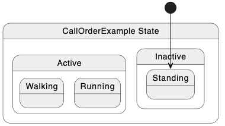

**State** refers to the value maintained by a logic block.

States can receive inputs, read values from the shared blackboard, and produce outputs and errors. Logic blocks don't actually do very much by themselves — the current state determines what inputs get handled.

States are always `record class` reference types that are derived from `StateLogic<TState>`, a type provided by LogicBlocks.

```csharp
using Chickensoft.Introspection;

[Meta, LogicBlock(typeof(State), Diagram = true)]
public partial class LightSwitch : LogicBlock<LightSwitch.State> {

  // Define the state. By convention, this is placed inside the logic block.
  public abstract record State : StateLogic<State> {
    // On state.
    public record PoweredOn : State, IGet<Input.Toggle> {}

    // Off state.
    public record PoweredOff : State, IGet<Input.Toggle> {
      public Transition On(in Input.Toggle input) => To<PoweredOn>();
    }
  }

  // Define your initial state here.
  public override Transition GetInitialState() => To<State.PoweredOff>();
}
```

Each state type can extend other state types using traditional C# inheritance, representing the idea of [compound states] from statechart theory.

Only one instance of a state is ever active at once. When a state instance is active, we say it is `attached`. When a state change occurs, the previous state instance is `detached`.

### 📥 Handling Inputs & State Changes

States define input handlers which allow them to receive inputs and return the next state th e
States indicate which inputs they handle by implementing `IGet<TInputType>` for each type of input they want to handle.

```csharp
public record MyState : State, IGet<Input.A>, IGet<Input.B>, IGet<Input.C> {
  // Don't change states on A
  public Transition On(in Input.A input) => ToSelf();

  // Go to StateC on C
  public Transition On(in Input.C input) => To<StateC>();
}
```

Input handlers are processed synchronously and always return a transition to the next state. We use `To<TState>()` method to define a transition to another state. If you don't want to change states, simply return `ToSelf()`.

States are stored on the blackboard.

### 🧑‍🏫 Blackboard

The **[blackboard]** is a type of dictionary collection that allows the logic block and its states to access shared data. States look up values stored in the blackboard by their system type.

The logic block keeps a blackboard internally, but doesn't expose it. Instead, it implements the `IBlackboard` interface, allowing you to treat it as if it were the blackboard.

```csharp
var logic = new MyLogicBlock();

// Add all the dependencies that states will need.
logic.Set<IService>(new MyRelatedService());

var service = logic.Get<IService>();
```

Each state instance has an internal context that allows it to interact with the logic block while it is attached. The base `StateLogic<TState>` class that every state derives from provides a `Get<T>()` method that allow the state to read values from the logic block's blackboard.

```csharp
[Meta, LogicBlock(typeof(State), Diagram = true)]
public partial class LightSwitch : LogicBlock<LightSwitch.State> {

  public abstract record State : StateLogic<State> {

    public record PoweredOn : State, IGet<Input.Toggle> {
      public PoweredOn() {
        OnAttach(() => {
          Get<MyRelatedService>().StartDoingSomething()
        });
      }
    }

  ...
```

### 🌱 Lifecycle Callbacks

#### 👩‍❤️‍👨 Attachment

When a state change occurs, the current state instance is `detached` and the next state instance is `attached`. Only one state instance is ever `attached` at once.

States can register callbacks that allow them to know when they become attached and detached.

```csharp
public MyState() {
  OnAttach(() => System.Console.WriteLine("MyState attached."))
  OnDetach(() => System.Console.WriteLine("MyState detached."))
}
```

:::info
For the sake of sanity, registering lifecycle callbacks should only be done in the state's constructor.
:::

#### 🚪 Entrance and Exits

States can also observe when they are `entered` and `exited`.

Unlike attachment, which is called every time a state instance is swapped for the active state of the logic block, entrance and exit callbacks are only invoked when the state's type hierarchy changes.

```csharp
public MyState() {
  this.OnEnter(() => System.Console.WriteLine("MyState entered."))
  this.OnExit(() => System.Console.WriteLine("MyState exited."))
}
```

**LogicBlocks guarantees correct behavior for entrance and exit callbacks with compound states** (states that inherit other states).

If you transition between two states that extend a common parent state, the common parent state will not have any of its exit callbacks invoked, since you are still in that _type_ of state.

:::info
Unlike `OnAttach` and `OnDetach`, you have to invoke `OnEnter` and `OnExit` as `this.OnEnter` and `this.OnExit`, respectively. LogicBlocks has to implement `this.OnEnter` and `this.OnExit` as extension methods to properly capture the generic context. Unlike in previous versions, you don't have to specify which type of state you are entering — it just knows.
:::

### 🏎️ Stopping and Starting

By default, a logic block will not create the first state until it is read, explicitly started, or receives an input. Lazily initializing state allows you to determine when the initial state should actually be attached and entered, guaranteeing that any _side effects_ don't occur until you're ready.

```csharp
var logic = new MyLogicBlock();

// Make sure the initial state is attached and entered.
logic.Start();

// Exit and detach the current state.
logic.Stop();
```

Starting and stopping a logic block triggers the relevant attach/detach and entrance/exit callbacks.

### ⠛ Compound / Composite States

LogicBlocks supports the concept of [compound states] (also known as composite states) as defined by statecharts. A compound state is simply a state which contains more than one state inside it.

:::info
States can define themselves in terms of other existing states, only accounting for the changes between them. Coding-by-difference like this helps prevents duplicate logic and ensure correctness.
:::

## Compound States

Since a state is also a logic block, a state can have its own substates and internal transitions. This is a key feature of statecharts, and it's supported by LogicBlocks too.

Let's create a simple calculator with different operation modes (add, subtract, etc).



Every state has the ability to add child states when it's attached to a logic block. This makes it easy to create recursive, hierarchical state structures.

```csharp
public class Calculator : LogicBlock<IState> {
  public Calculator(LogicBlockSettings settings) : base(settings) { }

  public class Add : LogicState {
    protected override void OnEnter() =>
      Debug.WriteLine("Add mode enabled");
    public class Push : Input<int> { }
  }

  public class Subtract : LogicState {
    protected override void OnEnter() =>
      Debug.WriteLine("Subtract mode enabled");
    public class Push : Input<int> { }
  }

  // ... etc ...
}
```

## Initialization Call Order

The following diagram shows the order of function calls during initialization:



[compound states]: https://statecharts.dev/glossary/compound-state.html
[blackboard]: https://github.com/chickensoft-games/Collections?tab=readme-ov-file#blackboard
