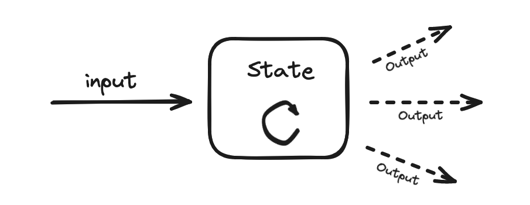

Before diving into more code examples, it can be helpful to understand the theory behind a logic block. Logic blocks are inspired by statecharts, so if you haven't already read about them on [statecharts.dev], it's well worth your time to do so.

:::tip
Don't worry too much about understanding all the theory up-front. There's also a [tutorial] that will guide you through creating a fully-fledged logic block that covers all the typical use cases. The tutorial will explain each concept as it introduces it, too — in case it wasn't clear from this article.
:::

_A logic block is a class that **receives inputs**, **maintains a single state instance**, and **produces outputs**_.

An **input** is simply an object containing any relevant information that is given to the current state to process. Inputs are processed one at a time and in the order they were received by whatever state is active at the time the input is processed.

A **state** is an object with "lifecycle hooks" that allow it to observe when it has been attached to the logic block that owns it, detached, entered, or exited. Only one state object instance is ever active at once. The active state is considered the logic block's current `Value`.

A state can implement input handlers for each type of input it wishes to handle, returning the next state the logic block should transition to.

After being attached, a state can produce one or more outputs at any time.

An **output** is a temporary object that contains information related to state behavior. Outputs are emitted by the logic block to any bindings or logic block listeners subscribed to the logic block, allowing the logic block's states to create side effects without being tightly coupled to other components.

The **blackboard** is a simple dictionary that allows the logic block and its states to access shared data. A logic block can set data in the blackboard from its constructor. States look up values stored in the blackboard by their system type.

:::note
You may have noticed we borrowed the term _blackboard_ from behavior trees — it's a nice way to decouple states from the dependencies they need.
:::

[tutorial]: ../tutorial/
[statecharts.dev]: https://statecharts.dev/
